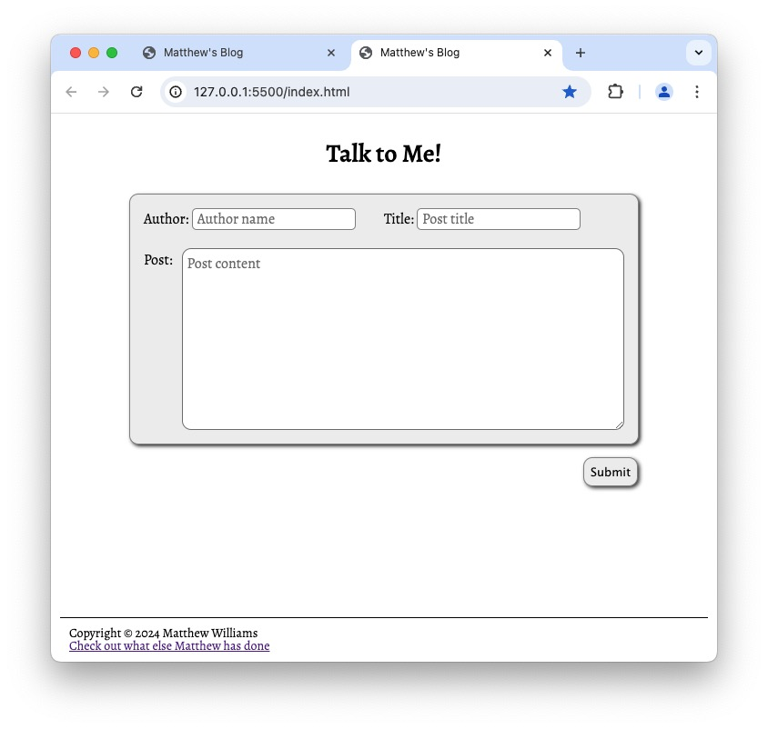

# Project Title
Matthew's Blog, Challenge 04

## Description
Matthew's Blog is a simple app for writing, saving, and retrieving blog posts.

## Installation

Matthew's Blog requires no installation.

## Usage
A screen shot of the form page of Matthew's Blog is presented below. To link to the blog, click [here](https://matthewwilliamscmh.github.io/Matthews-blog/index.html).

.

Starting only with a read-me file outlining the requirements for completion, I wrote HTML, CSS, and Javascript that creates a blog. On opening the blog, users are presented with three fields to complete: author name, title of the post, and the content of the post itself. Users click the Submit button to save the post; posts will not be accepted if any of the three fields is blank. When a post is accepted, the data collected is written into local storage, the post form page is closed, and a page showing snippets of all of the blog posts that have been retrieved from local storage opens. Users may select any of the snippets to display the full post. A dark theme is available for users who find reading easier with a darker background; users click on the slider in the list-page heading to activate dark mode or to return to light mode. If users would like to write another post, they click the New Post button in the list-page heading to close the list window and reopen the post form. The width of the form and the blog list are deliberately limited for comfortable reading, but they do respond to viewports that are narrower than their maximum width. The blog is also written to be accessible on mobile devices.

## Credits

John Titus tutored me on the routine that pushes posts to saved storage. I relied on a lot of hints and refreshers from the web to complete this challenge. Among the most helpful sites were specific-case posts on [Stack Overflow](https://stackoverflow.com), [SheCodes](https://www.shecodes.io/athena/), [MDN Web Docs](https://developer.mozilla.org), and [W3Schools](https://www.w3schools.com). I adapted code from https://www.w3schools.com/howto/howto_css_switch.asp to build the dark-mode toggle switch.

## Version History

* 0.1
    * Initial Releasse

## License

Matthew's Blog is licensed under the MIT License - see the LICENSE.md file for details.